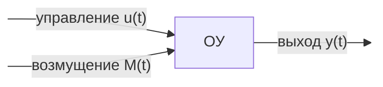
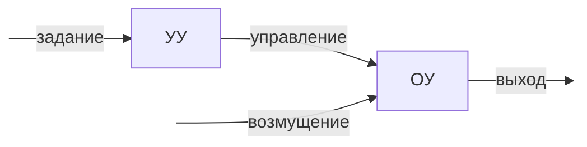
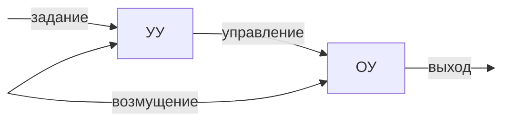
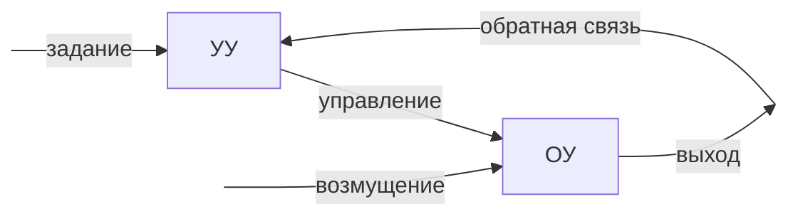

**Объект управления (ОУ)** - Техническое устройство или физический процесс, на поведение которого можно оказать какое-либо влияние.

*Управление* - воздействие на объект управления с целью изменения его поведения нужным образом.

*Автоматическое управление (регулирование)* - обеспечение заданного состояния регулируемых переменных (выхода) автоматически с помощью технического устройства (регулятора).

[[Система автоматического управления]] (САУ) состоит из:
## Основные принципы управления

### Принцип разомкнутого (программного) управления 

Недостатки:
1. Необходима полная информация о модели ОУ.
2. Невозможно устранить влияние возмущений.

### Принцип компенсации (управление по возмущению)

Недостатки:
1. Необходима полная информация о модели ОУ.
2. Требуется измерение возмущающих воздействий.
### Принцип обратной связи (управление по отклонению)

Достоинства:
1. Управление при неполной информации о модели ОУ.
2. Не требуется измерение возмущающих воздействий.

Все вот это (графы) - Система автоматического управления (САУ).

