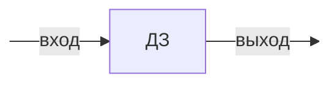
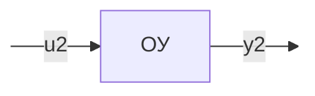
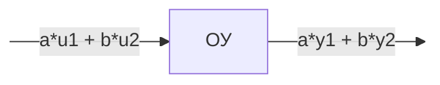

*Система* - совокупность элементов, объединенных общим режимом функционирования.

*Динамическая система* - система, процессы в которой изменяются со временем.

## Динамическое звено

**Динамическое звено** — это элемент системы управления, который описывает зависимость выходного сигнала от входного с учётом динамики (изменения во времени).

## Динамическая характеристика

**Динамическая характеристика** - любое соотношение, заданное аналитически, таблицей или графиком, которое позволяет описать поведение динамической системы (ОУ) во времени.

Линейная динамическая система (линейный ОУ) - справедлив принцип суперпозиции

Динамические характеристики:

1. [[Дифференциальные уравнения]]
2. [[Структурные схемы]]
3. [[Передаточные функции]]
4. [[Частотные характеристики]]
5. [[Временные характеристики]]
6. [[Переходная матрица]]
7. [[Модальные характеристики]]

## Этапы построения математической модели ОУ

- Построить описательную модель объекта управления.
- Выделить следующие группы переменных: 
  1. Управляющие воздействия (управление, вход).
  2. Выходные переменные (выход).
  3. Возмущающие воздействия (возмущение).
  4. Вектор состояния.
- Записать основные физические законы, описывающие процессы в ОУ.
- Записать уравнения, связывающие все переменные между собой.