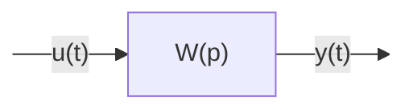

Определение 1: Передаточной функцией динамического звена называется отношение изображения по Лапласу выходного сигнала к изображению по Лапласу входного сигнала, полученные при нулевых начальных условиях.

Вводится оператор дифференцирования $p=\frac{d}{dt}$
Тогда дифференциальное уравнение можно записать в операторном виде
$p^2y + a_1py + a_0y = b_0u$ 
вынесем y
$(p^2+a_1p+a0)y=b_0u$ 

$(p^2+a_1p+a0)$ - собственный оператор $A(p)$
$b_0$ - оператор входа $B(p)$

Передаточной функцией динамического звена называется отношение оператора входа к собственному оператору.

$W(p)=\frac{b_0}{(p^2+a_1p+a0)}$ - передаточная функция

## Нули и полюса передаточных функций

*Нули* - корни оператора входа
*Полюса* - корни собственного оператора
$A(p) = 0$ - характеристическое уравнение звена
