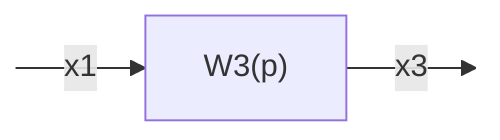
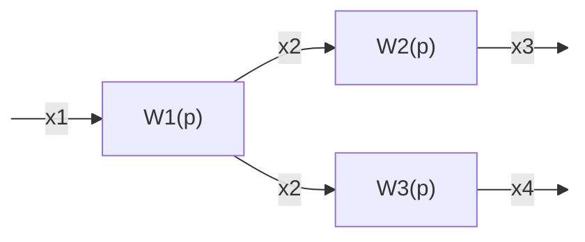
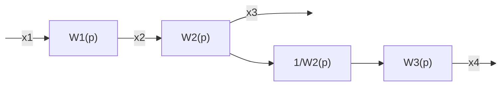
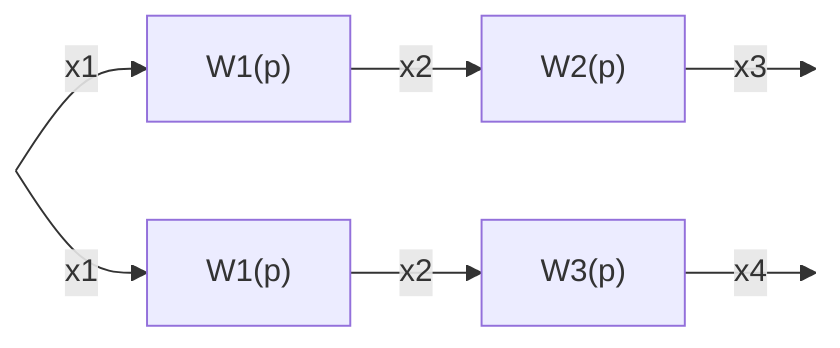
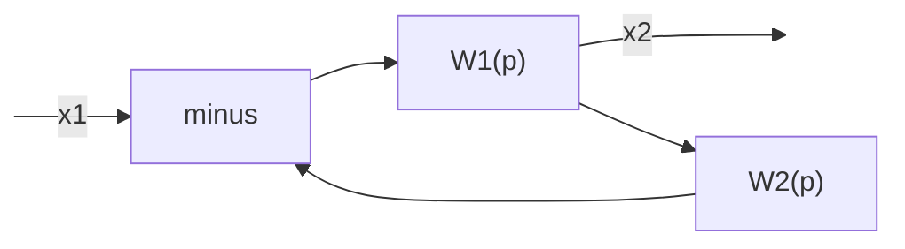
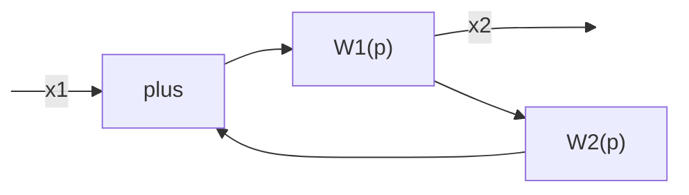
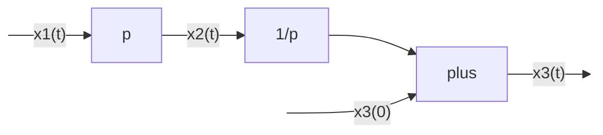
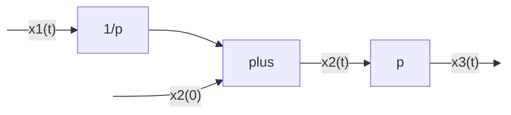

1. Последовательное соединение звеньев 
2. Параллельное соединение звеньев 
3. Перенос узла 
4. Перенос сумматора 
5. Преобразование схем с обратной связью
6. Перестановка сумматоров

Схемы должны сохранять свойства после преобразований.

## Последовательное соединение звеньев

````mermaid
flowchart LR
    1:::none -->|x1| b1["W1(p)"] -->|x2| b2["W2(p)"] -->|x3| 2:::none

    classDef none display:none;
````
$x_2 = W_1(p)x_1$
$x_3 = W_2(p)x_2$ 

Свернуть в 1 звено:



$x_3 = W_2(p)W_1(p)x_1$

$W_3 = W_1(p)*W_2(p)$ 

Передаточная функция для последовательно соединенных звеньев равна произведению передаточных функций этих звеньев.

## Параллельное соединение звеньев

````mermaid
graph LR

1:::none -->|x1| 2:::none

2:::none --> w1["W1(p)"]

2:::none --> w2["W2(p)"]

w1 -->|x2| sum
w2 -->|x3| sum

sum -->|x4| 3:::none

classDef none display:none;
````

$x_2 = W_1(p)x_1$
$x_3 = W_2(p)x_1$ 

$x_4 = x_2 + x_3$

$W_3 = W_1(p)+W_2(p)$ 

Передаточная функция для параллельно соединенных звеньев равна сумме передаточных функций этих функций.
## Перенос узла



1) Перенос узла на выход звена




1) Перенос узла на вход звена


## Перенос сумматора

Как в переносе узла

## Преобразование схемы с обратной связью

Получение результирующей передаточной функции из многих, где есть обратная связь.

Путем преобразований выражается $x_2$ и потом передаточная функция.

1. С отрицательной обратной связью
	$W(p)=\frac{W_1(P)}{1+W_1(p)W_2(p)}$


1. С положительной обратной связью
	$W(p)=\frac{W_1(P)}{1-W_1(p)W_2(p)}$



## Перестановка сумматоров

От перестановки слагаемых сумма не изменяется.

Замечание: Аппарат передаточных функций совместно с правилами преобразований структурных схем может быть использован только в предположении, что в системе имеют место нулевые начальные условия.

Пример (ненулевые начальные условия):


p - дифференцирующее звено, 1/p - интегрирующее

По правилу последовательного соединения: $p * \frac{1}{p} = 1$, соответственно:
$x_3(t)=x_1(t) + x_3(0)$ 


$x_3(t) = x_1(t)$ т.к. производная константы = 0


Вывод: При ненулевых начальных условиях перестановка звеньев может изменить результат преобразования сигналов в системе.